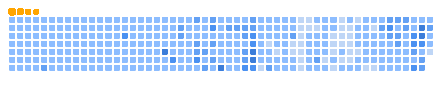

# Hi, I'm Hritik 👋

## My Story: Building With Heart

I’m Hritik, a 21-year-old engineering student from Bhopal, Madhya Pradesh—a builder, coder, and relentless optimist fueled by curiosity. My journey isn’t just about lines of code; it’s about turning ideas into tools that solve real problems for people.

Growing up, I was the kid dismantling gadgets to see how they ticked. That spark drives me now: diving deep into machine learning and deep learning. I’ve battled failed projects, 3 AM bugs, and ideas that flopped—but each setback taught resilience. Learn, iterate, rebuild stronger. The best fix ? Just build it.

What sets me apart? I focus on tech that matters—intelligent systems powered by deep learning—helping humans thrive in a digital world. JavaScript, Python, c++.
I’m fluent and always learning.

 Let’s connect. I’ll bring the heart, hustle, and fresh ideas—you bring the challenges. Together, we’ll build what lasts.

<!--  
<h1 align="center">Hi, I'm Hritik </h1>
<h3 align="center">CS undergrad at BIRT · Real-time Vision Enthusiast · Web Dev Explorer</h3> -->

  

---
<!-- Powered by vibes, iced americano, and a lil' bit of chaos 🌪️ -->

